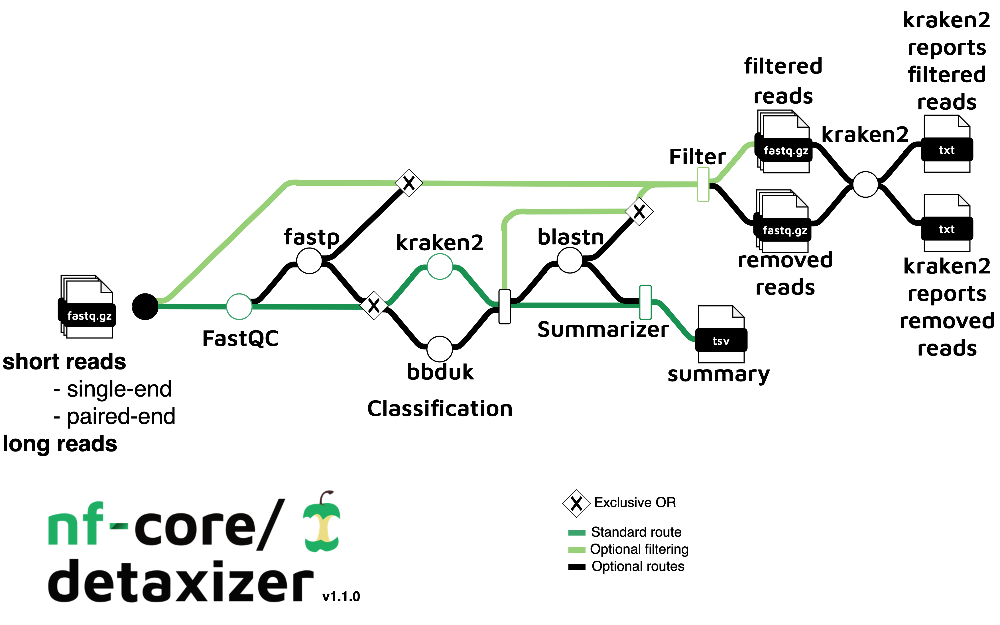

<h1>
  <picture>
    <source media="(prefers-color-scheme: dark)" srcset="docs/images/nf-core-detaxizer_logo_dark.png">
    
  </picture>
</h1>

[](https://github.com/nf-core/detaxizer/actions/workflows/ci.yml)
[](https://github.com/nf-core/detaxizer/actions/workflows/linting.yml)[](https://nf-co.re/detaxizer/results)[](https://doi.org/10.5281/zenodo.10877147)
[](https://www.nf-test.com)

[](https://www.nextflow.io/)
[](https://docs.conda.io/en/latest/)
[](https://www.docker.com/)
[](https://sylabs.io/docs/)
[](https://cloud.seqera.io/launch?pipeline=https://github.com/nf-core/detaxizer)

[](https://nfcore.slack.com/channels/detaxizer)[](https://twitter.com/nf_core)[](https://mstdn.science/@nf_core)[](https://www.youtube.com/c/nf-core)

## Introduction

**nf-core/detaxizer** is a bioinformatics pipeline that checks for the presence of a specific taxon in (meta)genomic fastq files and offers the option to filter out this taxon or taxonomic subtree. The process begins with preprocessing (adapter trimming, quality cutting and optional length and quality filtering) using fastp and quality assessment via FastQC, followed by taxon classification with kraken2, and employs blastn for validation of the reads associated with the identified taxa. Users must provide a samplesheet to indicate the fastq files and, if utilizing the validation step, a fasta file for creating the blastn database to verify the targeted taxon.



1. Read QC ([`FastQC`](https://www.bioinformatics.babraham.ac.uk/projects/fastqc/))
2. Pre-processing ([`fastp`](https://github.com/OpenGene/fastp))
3. Classification of reads ([`Kraken2`](https://ccb.jhu.edu/software/kraken2/))
4. Optional validation of searched taxon/taxa ([`blastn`](https://blast.ncbi.nlm.nih.gov/Blast.cgi))
5. Optional filtering of the searched taxon/taxa from the reads (either from the raw files or the preprocessed reads, using either the output from kraken2 or blastn)
6. Summary of the processes (how many reads were initially present after preprocessing, how many were classified as the `tax2filter` plus potential taxonomic subtree and optionally how many were validated)
7. Present QC for raw reads ([`MultiQC`](http://multiqc.info/))

## Usage

> [!NOTE]
> If you are new to Nextflow and nf-core, please refer to [this page](https://nf-co.re/docs/usage/installation) on how to set-up Nextflow. Make sure to [test your setup](https://nf-co.re/docs/usage/introduction#how-to-run-a-pipeline) with `-profile test` before running the workflow on actual data.

First, prepare a samplesheet with your input data that looks as follows:

```csv title="samplesheet.csv"
sample,short_reads_fastq_1,short_reads_fastq_2,long_reads_fastq_1
CONTROL_REP1,AEG588A1_S1_L002_R1_001.fastq.gz,AEG588A1_S1_L002_R2_001.fastq.gz,AEG588A1_S1_L002_R3_001.fastq.gz
```

Each row represents a fastq file (single-end) or a pair of fastq files (paired end). A third fastq file can be provided if long reads are present in your project. For more detailed information about the samplesheet, see the [usage documentation](docs/usage.md).

Now, you can run the pipeline using:

```bash
nextflow run nf-core/detaxizer \
   -profile <docker/singularity/.../institute> \
   --input samplesheet.csv \
   --outdir <OUTDIR>
```

> [!WARNING]
> Please provide pipeline parameters via the CLI or Nextflow `-params-file` option. Custom config files including those provided by the `-c` Nextflow option can be used to provide any configuration _**except for parameters**_;
> see [docs](https://nf-co.re/usage/configuration#custom-configuration-files).

For more details and further functionality, please refer to the [usage documentation](https://nf-co.re/detaxizer/usage) and the [parameter documentation](https://nf-co.re/detaxizer/parameters).

## Pipeline output

To see the results of an example test run with a full size dataset refer to the [results](https://nf-co.re/detaxizer/results) tab on the nf-core website pipeline page.
For more details about the output files and reports, please refer to the
[output documentation](https://nf-co.re/detaxizer/output).

## Credits

nf-core/detaxizer was originally written by [Jannik Seidel](https://github.com/jannikseidelQBiC) at the [Quantitative Biology Center (QBiC)](http://qbic.life/).

We thank the following people for their extensive assistance in the development of this pipeline:

- [Daniel Straub](https://github.com/d4straub)

This work was initially funded by the German Center for Infection Research (DZIF).

## Contributions and Support

If you would like to contribute to this pipeline, please see the [contributing guidelines](.github/CONTRIBUTING.md).

For further information or help, don't hesitate to get in touch on the [Slack `#detaxizer` channel](https://nfcore.slack.com/channels/detaxizer) (you can join with [this invite](https://nf-co.re/join/slack)).

## Citations

If you use nf-core/detaxizer for your analysis, please cite it using the following doi: [10.5281/zenodo.10877147](https://doi.org/10.5281/zenodo.10877147)

An extensive list of references for the tools used by the pipeline can be found in the [`CITATIONS.md`](CITATIONS.md) file.

You can cite the `nf-core` publication as follows:

> **The nf-core framework for community-curated bioinformatics pipelines.**
>
> Philip Ewels, Alexander Peltzer, Sven Fillinger, Harshil Patel, Johannes Alneberg, Andreas Wilm, Maxime Ulysse Garcia, Paolo Di Tommaso & Sven Nahnsen.
>
> _Nat Biotechnol._ 2020 Feb 13. doi: [10.1038/s41587-020-0439-x](https://dx.doi.org/10.1038/s41587-020-0439-x).
